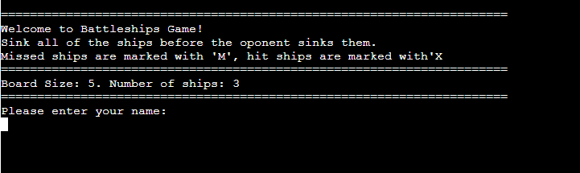
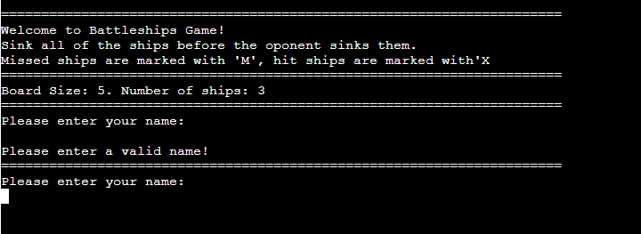

# The Battleship Game 3.0

In a battleships game, the player competes against the computer to sink each other's ships on a 5x5 grid. The objective is to guess the locations of the opponent's ships and sink them first. 

The game is text-based and interactive, allowing players to engage in a strategic battle against the computer.

[Here is the live version of the game](https://battleship-game-3-0-cf2f1acfc66f.herokuapp.com/)

## How to play

The game begins by prompting the player to enter their name.

Both the player and the computer have their boards with ships randomly placed. A player can see where their ships are placed.

Players take turns guessing coordinates to attack their opponent's ships. After entering a row and a column numbers, the result will be displayed. If you hit a ship, it will be marked with 'X'; if you miss, it will be marked with 'M'.

The game continues until one player sinks all the opponent's ships or until there's a tie if both reach a score of 3.

After the game ends, the final results are displayed, and a winner is declared. 

Players can play the game again by entering 'Y' for yes or 'N' for no.

## Features

The Battleship Game 3.0 offers several key features for its users.

### Existing Features

__Welcome Message:__

When a user starts a game, the first thing they see is a welcome message, a short game description and the prompt to enter player's name. This area serves as an entry point, welcoming users to the game and offering them a clear starting point, enhancing user experience. 

The user can start a game after entering the valid name. The name here is validated. If the input is empty, the user is asked to enter the valid name.

After entering the valid name, a user presses enter key the game begins.

___