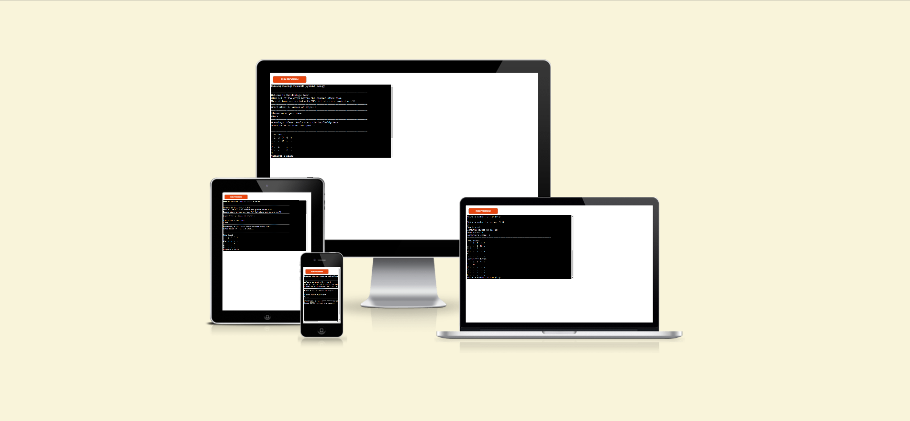
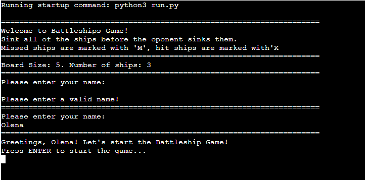
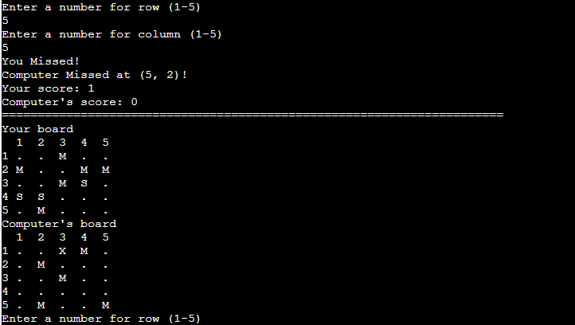

# The Battleship Game 3.0

In a battleships game, the player competes against the computer to sink each other's ships on a 5x5 grid. The objective is to guess the locations of the opponent's ships and sink them first. 

The game is text-based and interactive, allowing players to engage in a strategic battle against the computer.

[Here is the live version of the game](https://battleship-game-3-0-cf2f1acfc66f.herokuapp.com/)

## How to play

The game begins by prompting the player to enter their name.

Both the player and the computer have their boards with ships randomly placed. A player can see where their ships are placed.

Players take turns guessing coordinates to attack their opponent's ships. After entering a row and a column numbers, the result will be displayed. If you hit a ship, it will be marked with 'X'; if you miss, it will be marked with 'M'.

The game continues until one player sinks all the opponent's ships or until there's a tie if both reach a score of 3.

After the game ends, the final results are displayed, and a winner is declared. 

Players can play the game again by entering 'Y' for yes or 'N' for no.

## Features

The Battleship Game 3.0 offers several key features for its users.

### Existing Features

__Welcome Message__

When a user starts a game, the first thing they see is a welcome message, a short game description and the prompt to enter player's name. This area serves as an entry point, welcoming users to the game and offering them a clear starting point, enhancing user experience. 

The user can start a game after entering the valid name. The name here is validated. If the input is empty, the user is asked to enter the valid name.

After entering the valid name, a user presses enter key the game begins.

___
__Game Boards__

A user plays agains a computer. Each player has their own board. The game board is a 5x5 grid where you and the computer each have three ships placed on the board. A player can see where their ships are placed. Ships are marked with 'S'.

__
__Enter row and column number__

A user enters a row and column number between 1 and 5 to guess coordinates to attack the opponent's ships.

__Validating input__

Input validation is performed for coordinates entered by the player.

If the entered coordinates fall outside the valid range, the function displays an error messages indicating that the input is wrong and prompts the player to enter valid coordinates. 

Error messages:
- Input is out of range. Enter a number between 1 and 5.
- You have made a move in this position. Try again.
- Only enter numbers!

__Tracks hits and misses for both the player and the computer__

After making your guess, the game displays the result of your move. The textual output informs you whether it's a "hit" or "miss" and reveals the coordinates guessed by the computer. Additionally, it updates the score by counting the number of ships hit and updates both game boards accordingly. A successful hit on a ship is marked with 'X', whereas a miss is marked with 'M'. This feedback mechanism informs players of their progress and updates the game state based on their actions.

__Winning the Game__

The game ends when one player sinks all of the opponent's ships or when both players achieve a score of 3 in a tie.

__Playing Again__

After the game ends, you'll be prompted to play again by entering 'Y' for yes or 'N' for no.
If you choose to play again, the game will reset with new ship placements and scores.
When a user chooses 'N', the loop breaks.

## Future Features

- to play with a real player.
- players  place ships on the grid.
- the fleet includes 5 ships of different sizes: aircraft Carrier (5 squares), battleship (4 squares), cruiser (3 squares), submarine (3 squares), destroyer (2 squares).